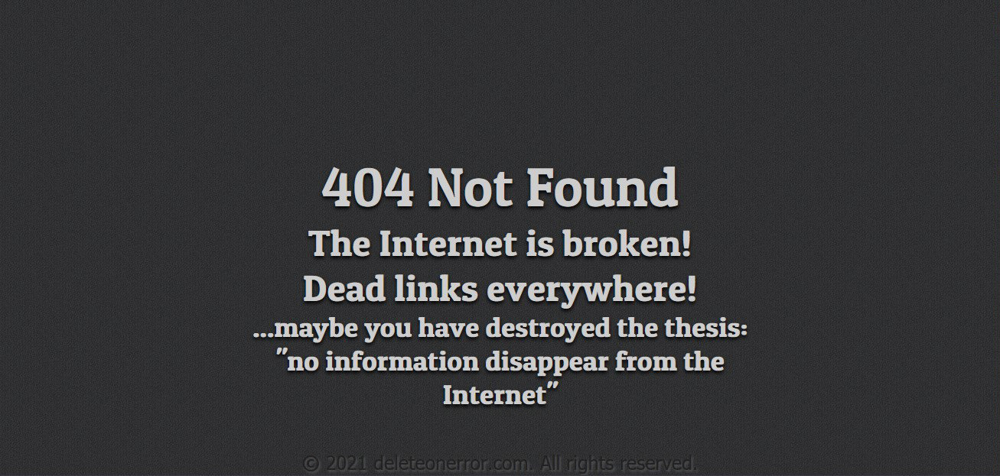

# 10kb Webserver error Pages



In case of a error you don't want to deliver your page viewer tons of data
this is a fire and forget implementation.
The copyright information in the footer is filled via JS (Year and URL)

## Setup (nginx)

- copy the `errorDoc` folder to `/var/www/errorDoc`
- copy the `error-pages.conf` to `/etc/nginx/snippets`
- include the config to your server config

``` config
server {

...

    include /etc/nginx/snippets/error-pages.conf;

...

}
```

## Todo's

- [] fix scaling for mobile devices
- [] add a 504 page
- [] add a maintenance-page
- [] add a rate-limit error page
